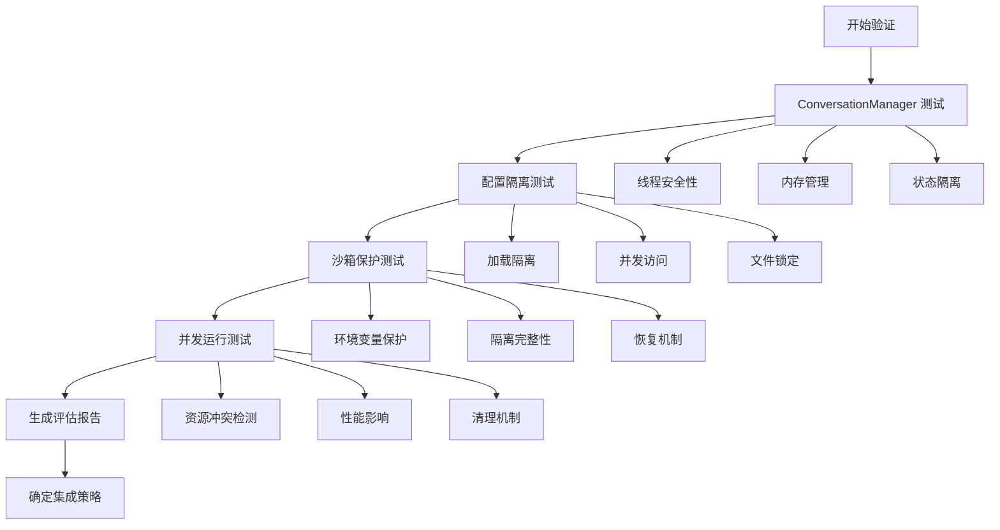

# Codex Web 与 TUI 集成兼容性最小验证实验

## 概述

这是一个专门为验证 Codex Web 与现有 codex-rs TUI 系统进程内集成兼容性而设计的最小验证实验。通过量化测试关键集成点，确保 Web 端能够安全复用现有核心能力，而不破坏 TUI 系统的稳定性。

## 核心不确定性分析

### 主要风险点
1. **ConversationManager 状态冲突**: 多个 UI 界面同时访问可能导致状态不一致
2. **配置文件竞争**: TUI 和 Web 同时修改配置可能导致数据腐化
3. **沙箱环境污染**: Web 组件可能意外修改关键沙箱环境变量
4. **资源竞争**: 端口、文件锁、内存等资源的并发访问冲突
5. **进程生命周期管理**: TUI 和 Web 的启动/关闭顺序和清理机制

### 高影响场景
- 一旦破坏现有 TUI 系统，用户将无法正常使用 Codex
- 沙箱策略被破坏可能导致安全漏洞
- 配置损坏会影响所有 Codex 功能

## 实验架构

### 测试组件

```
codex-rs/integration-test/
├── src/
│   ├── lib.rs                      # 主集成测试协调器
│   ├── main.rs                     # 可执行测试入口
│   ├── conversation_manager_test.rs # ConversationManager 测试
│   ├── config_isolation_test.rs     # 配置隔离测试
│   ├── sandbox_protection_test.rs   # 沙箱保护测试
│   └── concurrent_run_test.rs       # 并发运行测试
├── Cargo.toml                      # 项目配置
└── README.md                       # 本文档
```

### 验证流程



## 快速开始

### 1. 运行完整验证

```bash
# 在 codex-rs 目录下
cd integration-test

# 执行完整集成验证
cargo run --bin run-integration-test

# 或者运行测试套件
cargo test

# 启用详细日志
RUST_LOG=debug cargo run --bin run-integration-test
```

### 2. 查看验证结果

验证完成后会生成两个报告文件：

```bash
# JSON 格式报告（程序化处理）
cat integration_validation_report.json

# Markdown 格式报告（人类可读）
cat integration_validation_report.md
```

### 3. 理解验证结果

报告包含以下关键信息：

- **执行摘要**: 测试通过率、执行时间、整体可行性
- **详细测试结果**: 每个测试组件的具体表现
- **风险评估**: 风险等级和主要关注点
- **集成策略建议**: 基于测试结果的具体建议
- **量化指标表**: 对照成功标准的详细评估

## 测试重点说明

### 1. ConversationManager 进程内复用安全性

**测试内容**：
- 并发创建对话的线程安全性
- 内存泄漏检测
- 状态隔离验证

**成功标准**：
- 线程安全性验证通过
- 无内存泄漏
- 对话状态完全隔离

### 2. 配置文件共享和隔离策略

**测试内容**：
- 独立配置加载隔离
- 并发配置访问安全性
- 文件锁冲突检测
- 环境变量覆盖隔离

**成功标准**：
- TUI 和 Web 配置加载互不干扰
- 共享配置保持一致性
- 无配置文件腐化

### 3. 沙箱环境变量完整性保护

**测试内容**：
- `CODEX_SANDBOX_*` 变量保护
- 环境隔离完整性
- 恢复机制验证
- 策略一致性检查

**成功标准**：
- 关键沙箱变量受到保护
- 无隔离破坏
- 环境恢复机制正常

### 4. TUI 和 Web 同时运行互不干扰

**测试内容**：
- 并发启动兼容性
- 资源冲突检测（端口、文件锁）
- 性能影响评估
- 清理和关闭机制

**成功标准**：
- 可以同时运行
- 无资源冲突
- 性能降级 < 25%
- 清理机制完善

## 量化成功标准

### 关键性能指标 (KPIs)

| 指标 | 目标值 | 权重 | 说明 |
|------|--------|------|------|
| ConversationManager 线程安全 | 100% 通过 | ⚠️  高 | 必须通过，否则存在数据竞争风险 |
| 配置隔离有效性 | 100% 通过 | ⚠️  高 | 必须通过，否则配置冲突 |
| 沙箱变量保护 | 100% 通过 | 🔴 关键 | 必须通过，否则安全漏洞 |
| 并发运行兼容性 | 95% 通过 | ⚠️  高 | 允许少量非关键功能冲突 |
| 内存使用增长 | < 50% | 📊 中 | 控制资源消耗 |
| 性能降级 | < 25% | 📊 中 | 保证用户体验 |
| 启动时间增长 | < 100% | 📊 低 | 影响用户体验但非关键 |

### 风险等级定义

- **🟢 低风险** (0-2 分): 可以直接进程内集成
- **🟡 中风险** (3-6 分): 需要额外隔离机制
- **🟠 高风险** (7-10 分): 建议混合模式或独立进程
- **🔴 关键风险** (11+ 分): 不建议集成，需重新设计

### 集成策略决策矩阵

| 风险等级 | 通过率 | 推荐策略 |
|----------|--------|----------|
| 🟢 低 | ≥90% | 直接进程内集成 |
| 🟡 中 | ≥75% | 进程内 + 隔离机制 |
| 🟠 高 | ≥60% | 混合模式 |
| 🔴 关键 | <60% | 独立进程通信 |
| 🚫 不可行 | <40% | 不建议集成 |

## 监控策略

### 实时监控点

1. **内存使用监控**
   ```rust
   // 监控进程内存使用变化
   let memory_usage = get_process_memory_usage();
   assert!(memory_usage.rss < baseline * 1.5);
   ```

2. **文件访问冲突检测**
   ```rust
   // 检测配置文件并发访问
   let lock_result = try_acquire_file_lock(&config_file);
   assert!(lock_result.is_ok(), "配置文件锁冲突");
   ```

3. **环境变量完整性检查**
   ```rust
   // 验证关键环境变量未被修改
   let sandbox_var = env::var("CODEX_SANDBOX");
   assert_eq!(sandbox_var, expected_value);
   ```

### 持续验证机制

```bash
# 集成到 CI/CD 中
#!/bin/bash
cd codex-rs/integration-test

# 运行验证
if cargo run --bin run-integration-test; then
    echo "✅ 集成验证通过，可以继续部署"
    exit 0
else
    echo "❌ 集成验证失败，阻止部署"
    exit 1
fi
```

## 故障排除

### 常见问题

1. **测试失败: "ConversationManager 线程安全性验证失败"**
   - 检查是否有全局状态竞争
   - 验证锁机制是否正确实现
   - 查看是否有未处理的异步操作

2. **测试失败: "沙箱环境变量保护失效"**
   - 确认环境变量恢复机制
   - 检查是否有意外的环境变量修改
   - 验证沙箱策略配置

3. **性能降级过大**
   - 检查是否有不必要的资源分配
   - 优化并发操作的效率
   - 考虑延迟初始化策略

### 调试建议

```bash
# 启用详细调试输出
RUST_LOG=debug cargo test -- --nocapture

# 运行单独的测试组件
cargo test test_conversation_manager_integration
cargo test test_config_isolation_comprehensive
cargo test test_sandbox_environment_protection
cargo test test_concurrent_operation_compatibility

# 生成测试覆盖率报告
cargo tarpaulin --out Html
```

## 实验价值

### 1. 技术风险评估
量化不同集成方案的技术风险，为架构决策提供数据支持。

### 2. 性能基线建立
为后续的性能优化和监控建立基线数据。

### 3. 集成策略验证
验证不同集成策略的可行性和效果。

### 4. 持续集成保障
提供自动化的集成兼容性检查机制。

## 扩展和定制

### 添加新的测试场景

```rust
// 在 lib.rs 中添加新的测试方法
impl IntegrationCompatibilityValidator {
    async fn test_custom_scenario(&self) -> Result<CustomTestResult, Box<dyn std::error::Error>> {
        // 实现自定义测试逻辑
        todo!()
    }
}
```

### 调整成功标准

修改 `generate_overall_assessment` 方法中的评分逻辑：

```rust
// 自定义风险评分权重
let mut risk_score = 0;
if !conv.thread_safety_verified {
    risk_score += 5; // 调整权重
}
```

### 集成到现有工作流

```yaml
# GitHub Actions 示例
name: Integration Compatibility Test
on: [push, pull_request]

jobs:
  integration-test:
    runs-on: ubuntu-latest
    steps:
      - uses: actions/checkout@v2
      - name: Run Integration Test
        run: |
          cd codex-rs/integration-test
          cargo run --bin run-integration-test
      - name: Upload Test Report
        uses: actions/upload-artifact@v2
        with:
          name: integration-report
          path: integration_validation_report.*
```

---

这个最小验证实验能够在最短时间内为 Codex Web 项目的集成决策提供可靠的数据支持，确保在不破坏现有系统的前提下实现 Web 端功能。