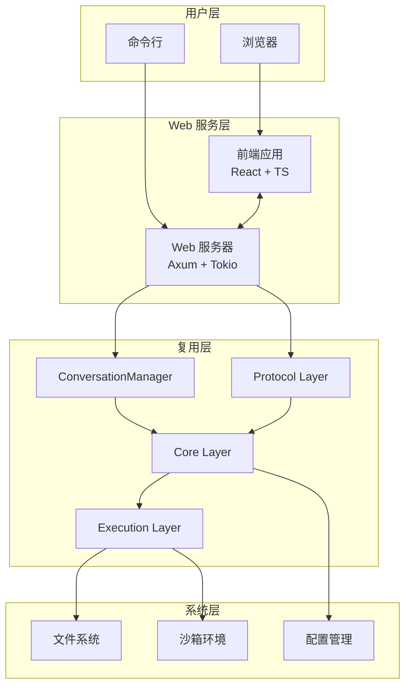
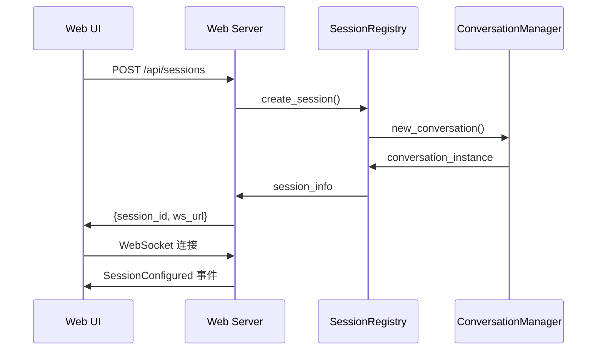
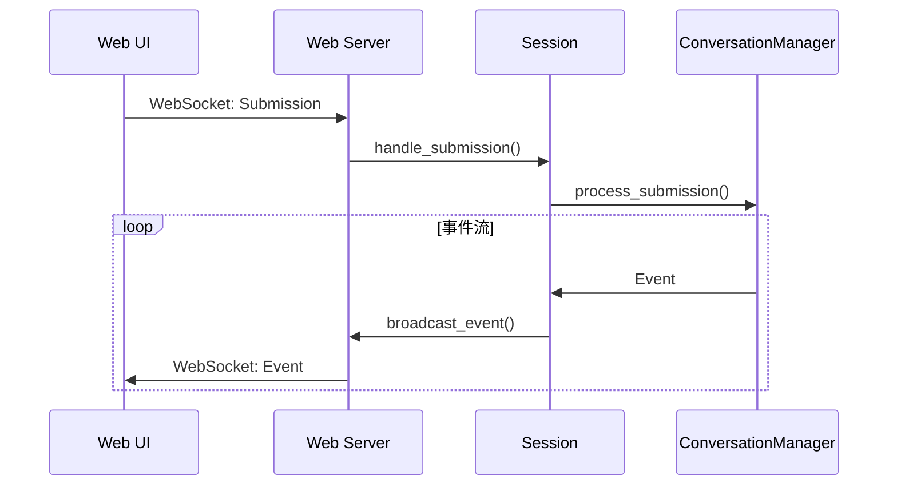
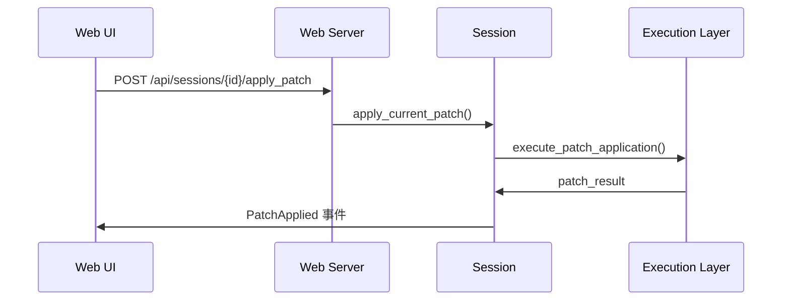

# 总体架构设计

**文档版本**: v1.0  
**最后更新**: 2025-09-11  
**依赖文档**: [01-requirements.md](01-requirements.md)  
**后续文档**: [03-backend-design.md](03-backend-design.md), [04-frontend-design.md](04-frontend-design.md)

## 目录
- [设计原则](#设计原则)
- [技术栈选择](#技术栈选择)
- [系统架构概览](#系统架构概览)
- [组件设计](#组件设计)
- [数据流设计](#数据流设计)
- [与现有系统集成](#与现有系统集成)
- [通信协议设计](#通信协议设计)
- [技术决策](#技术决策)
- [架构权衡](#架构权衡)

## 设计原则

### 1. 复用优先 (Reuse First)
- 严格复用现有 `codex-rs` 的核心能力
- 避免重复实现业务逻辑
- 保持与 TUI 的功能一致性

### 2. 进程内集成 (In-Process Integration)
- 优先使用进程内调用
- 共享配置、身份、沙箱环境
- 避免复杂的 IPC 机制

### 3. 安全本地化 (Secure Local)
- 仅本地访问，不暴露远程端口
- 最小权限原则
- 遵守现有安全策略

### 4. 渐进增强 (Progressive Enhancement)
- 核心功能优先实现
- 支持功能的渐进扩展
- 优雅降级策略

### 5. 开发友好 (Developer Friendly)
- 清晰的模块边界
- 易于调试和测试
- 完善的错误处理

## 技术栈选择

### 后端技术栈

#### Rust + Axum + Tokio
```
codex-web (Rust crate)
├── axum (Web 框架)
├── tokio (异步运行时)
├── tower-http (HTTP 中间件)
├── serde (序列化)
└── codex-core (复用现有能力)
```

**选择理由**：
- **一致性**：与现有 `codex-rs` 技术栈保持一致
- **性能**：异步高性能，内存安全
- **生态兼容**：可直接复用现有 crate 和工具
- **维护性**：团队已有经验，降低维护成本

#### 依赖详情
```toml
[dependencies]
axum = "0.7"                    # Web 框架
tokio = { version = "1.0", features = ["full"] }
tokio-stream = "0.1"           # Stream 处理
tower-http = "0.5"             # HTTP 中间件
serde = { version = "1.0", features = ["derive"] }
serde_json = "1.0"             # JSON 序列化
tracing = "0.1"                # 日志
anyhow = "1.0"                 # 错误处理
parking_lot = "0.12"           # 锁原语
dashmap = "5.5"                # 并发哈希表
uuid = { version = "1.0", features = ["v4"] }
include_dir = "0.7"            # 静态资源嵌入（可选）

# 复用现有能力
codex-core = { path = "../core" }
codex-common = { path = "../common" }
codex-protocol = { path = "../protocol" }
codex-exec = { path = "../exec" }
```

### 前端技术栈

#### React + TypeScript + Vite
```
apps/codex-web-ui (npm package)
├── React 18 (UI 框架)
├── TypeScript (类型安全)
├── Vite (构建工具)
├── TanStack Query (状态管理)
└── 生成的协议类型 (类型安全)
```

**选择理由**：
- **成熟生态**：丰富的组件库和工具支持
- **开发效率**：热更新、快速构建
- **类型安全**：TypeScript + 生成类型确保一致性
- **可维护性**：组件化架构，易于测试和维护

#### 核心依赖
```json
{
  "dependencies": {
    "react": "^18.2.0",
    "react-dom": "^18.2.0",
    "@tanstack/react-query": "^5.0.0",
    "react-markdown": "^9.0.0",
    "highlight.js": "^11.9.0",
    "ansi-to-html": "^0.7.2"
  },
  "devDependencies": {
    "vite": "^5.0.0",
    "@vitejs/plugin-react": "^4.0.0",
    "typescript": "^5.0.0",
    "@types/react": "^18.2.0",
    "@types/react-dom": "^18.2.0"
  }
}
```

## 系统架构概览

### 整体架构图



### 分层设计

#### 1. 表示层 (Presentation Layer)
- **Web UI**: React 单页应用，提供用户界面
- **CLI Integration**: 命令行启动和配置

#### 2. 服务层 (Service Layer) 
- **Web Server**: HTTP/WebSocket 服务，API 网关
- **Session Management**: 会话生命周期管理
- **Static Assets**: 静态资源服务

#### 3. 业务层 (Business Layer)
- **Conversation Manager**: 会话管理（复用）
- **Protocol Handling**: 协议处理（复用）
- **Event Processing**: 事件流处理（复用）

#### 4. 基础层 (Infrastructure Layer)
- **Core Services**: 核心服务（复用）
- **Execution Engine**: 执行引擎（复用）
- **Configuration**: 配置管理（复用）

## 组件设计

### 核心组件关系

```mermaid
classDiagram
    class WebServer {
        +start_server()
        +handle_http()
        +handle_websocket()
        +serve_static()
    }
    
    class SessionRegistry {
        +create_session()
        +get_session()
        +cleanup_sessions()
    }
    
    class Session {
        +conversation: Conversation
        +subscribers: Vec~WebSocket~
        +last_event_id: u64
        +handle_submission()
        +broadcast_event()
    }
    
    class ConversationManager {
        +new_conversation()
        +handle_event()
        +handle_submission()
    }
    
    class EventBroadcaster {
        +subscribe()
        +unsubscribe()
        +broadcast()
    }
    
    WebServer --> SessionRegistry
    SessionRegistry --> Session
    Session --> ConversationManager
    Session --> EventBroadcaster
    ConversationManager --> "codex-core"
```

### 组件职责

#### WebServer
- HTTP 服务器管理
- 路由分发和中间件
- WebSocket 连接管理
- 静态资源服务
- 错误处理和日志

#### SessionRegistry
- 会话创建和销毁
- 会话生命周期管理
- 资源清理和 TTL
- 并发安全的会话访问

#### Session
- 单个会话状态管理
- 事件订阅者管理
- 事件流的缓存和重放
- 提交处理和响应

#### EventBroadcaster
- WebSocket 连接池管理
- 事件广播机制
- 连接状态监控
- 自动重连支持

## 数据流设计

### 主要数据流路径

#### 1. 会话创建流程


#### 2. 消息处理流程


#### 3. 补丁应用流程


### 数据存储设计

#### 内存中的数据结构
```rust
// 全局会话注册表
type SessionRegistry = DashMap<SessionId, Arc<Session>>;

// 会话状态
struct Session {
    id: SessionId,
    conversation: Arc<Conversation>,
    subscribers: Arc<RwLock<Vec<WebSocketSender>>>,
    last_event_offset: AtomicU64,
    created_at: Instant,
    last_activity: AtomicInstant,
}

// 事件缓存（用于重连恢复）
struct EventCache {
    events: VecDeque<(u64, Event)>,
    max_size: usize,
}
```

#### 持久化数据
- **配置文件**: 复用现有 `codex-rs` 配置
- **历史记录**: 复用现有 `RolloutRecorder`
- **会话状态**: 内存存储，服务重启后丢失

## 与现有系统集成

### TUI 能力映射

| TUI 能力 | Web 端实现 | 复用组件 |
|---------|-----------|---------|
| 会话/对话 | WebSocket 事件流 | `ConversationManager` |
| 流式输出 | 服务端推送 | `Event` 流处理 |
| Diff/Patch | HTTP API + UI 渲染 | Core 补丁能力 |
| 用户审批 | 交互式 UI 表单 | `AskForApproval` 事件 |
| 文件搜索 | API + UI 组件 | `exec` 工具链 |
| 历史/恢复 | HTTP API | `RolloutRecorder` |
| 登录/信任 | API + UI 流程 | 现有登录逻辑 |

### 共享能力

#### 1. 配置管理
```rust
// 复用现有配置加载
let config = Config::load_with_cli_overrides(&cli_overrides)?;
let conversation_manager = ConversationManager::new(config.clone());
```

#### 2. 身份认证
```rust
// 复用现有登录状态
let auth_state = AuthState::from_config(&config);
if !auth_state.is_authenticated() {
    return Err(AuthenticationRequired);
}
```

#### 3. 沙箱环境
```rust
// 严格遵守现有沙箱策略
let sandbox_config = SandboxConfig::from_env();
// 不允许修改任何 CODEX_SANDBOX_* 变量
```

### 数据一致性保证

#### 配置同步
- Web 端和 TUI 共享相同的配置文件
- 运行时配置覆盖保持一致性
- 配置变更通过统一接口处理

#### 状态共享
- 历史记录通过 `RolloutRecorder` 统一管理
- 身份认证状态全局共享
- 沙箱策略保持完全一致

## 通信协议设计

### WebSocket vs SSE 选择

#### WebSocket (推荐)
**优势**：
- 双向通信，延迟低
- 支持二进制数据
- 连接状态明确
- 更好的错误处理

**实现**：
```rust
async fn handle_websocket(
    ws: WebSocketUpgrade,
    Extension(sessions): Extension<Arc<SessionRegistry>>,
    Path(session_id): Path<SessionId>,
) -> Response {
    ws.on_upgrade(move |socket| handle_session_websocket(socket, sessions, session_id))
}
```

#### SSE 备选方案
**用途**：
- 代理环境兼容性问题时的备选
- 某些企业网络环境的兼容性

**实现**：
```rust
async fn handle_sse(
    Path(session_id): Path<SessionId>,
    Extension(sessions): Extension<Arc<SessionRegistry>>,
) -> Sse<impl Stream<Item = Result<Event, Infallible>>> {
    // 服务端推送事件流
}
```

### 消息格式设计

#### 统一消息封装
```typescript
interface WebSocketMessage {
  type: 'event' | 'submission' | 'heartbeat' | 'error';
  id: string;
  timestamp: number;
  payload: Event | Submission | HeartbeatData | ErrorData;
}
```

#### 类型生成流程
```bash
# 从 Rust 协议定义生成 TypeScript 类型
cargo run -p codex-cli -- generate-ts -o apps/codex-web-ui/src/protocol
```

## 技术决策

### 1. 架构模式选择

#### 选择：事件驱动架构 (Event-Driven Architecture)
**理由**：
- 与现有 TUI 事件模型完全一致
- 天然支持异步和流式处理
- 易于扩展和调试

#### 替代方案：请求-响应模式
**缺点**：
- 无法支持流式输出
- 需要轮询或长连接
- 与现有架构差异大

### 2. 状态管理策略

#### 选择：服务端状态 + 客户端缓存
**理由**：
- 权威状态在服务端，避免不一致
- 客户端仅做展示和缓存
- 支持多标签页同步

#### 状态分层：
```typescript
// 服务端权威状态
interface ServerState {
  sessions: Map<SessionId, Session>;
  conversations: Map<ConversationId, Conversation>;
}

// 客户端缓存状态  
interface ClientState {
  currentSession: SessionId | null;
  eventHistory: Event[];
  uiState: UIState;
}
```

### 3. 错误处理策略

#### 分层错误处理
```rust
#[derive(Debug, thiserror::Error)]
enum WebError {
    #[error("会话不存在: {0}")]
    SessionNotFound(SessionId),
    
    #[error("认证失败: {0}")]
    AuthenticationFailed(String),
    
    #[error("WebSocket 错误: {0}")]
    WebSocketError(String),
    
    #[error("核心服务错误: {0}")]
    CoreError(#[from] codex_core::Error),
}
```

#### 客户端错误恢复
```typescript
class ErrorRecoveryStrategy {
  handleWebSocketClose() {
    // 自动重连逻辑
  }
  
  handleApiError(error: ApiError) {
    // 错误分类和恢复
  }
  
  handleNetworkError() {
    // 网络异常处理
  }
}
```

## 架构权衡

### 1. 性能 vs 简单性

#### 权衡：选择简单性
- 优先代码可维护性
- 性能优化在必要时进行
- 避免过早优化

#### 具体体现：
- 使用 JSON 而非二进制协议（可读性）
- 内存中存储会话状态（简单性）
- 单进程架构（部署简单）

### 2. 功能完整性 vs 开发速度

#### 权衡：分阶段实现
- 核心功能优先
- 高级功能后续迭代
- 保持架构扩展性

### 3. 安全性 vs 易用性

#### 权衡：安全性优先
- 仅本地访问，牺牲远程便利性
- 严格遵守现有安全策略
- 一次性令牌，增加复杂性但提高安全性

### 4. 实时性 vs 资源消耗

#### 权衡：适度实时性
- WebSocket 保持连接（实时性）
- 合理的超时和清理策略（资源控制）
- 事件缓存支持重连恢复（可靠性）

---

**变更记录**：
- v1.0 (2025-09-11): 初始版本，完整架构设计文档