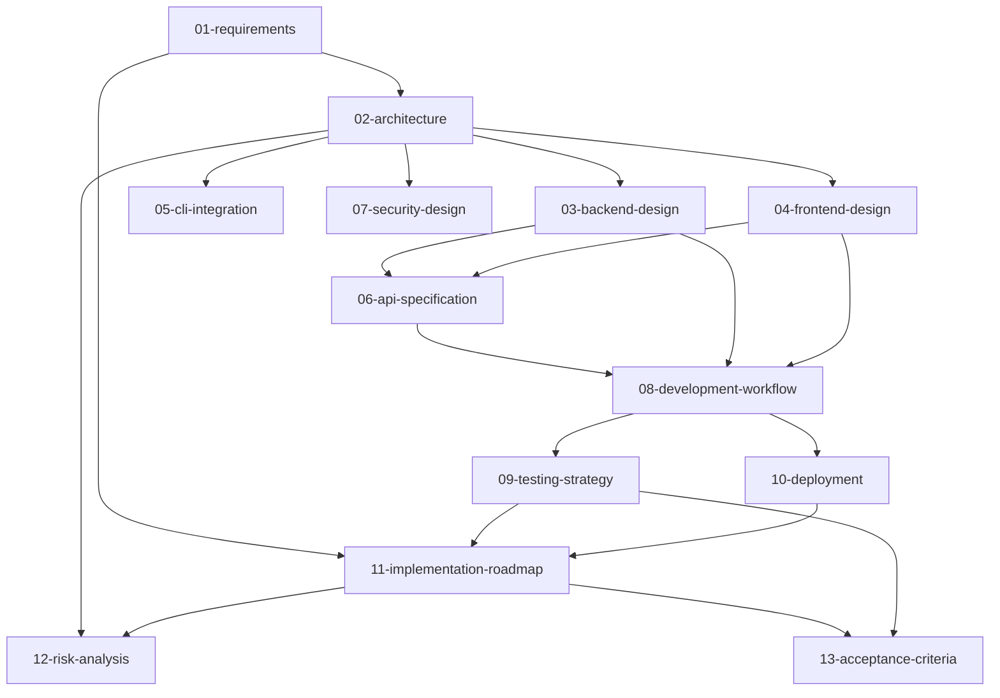

# Codex Web 端设计方案文档集

## 概述

本文档集提供了在现有 Codex 架构基础上实现 Web 端的完整设计方案。Web 端将通过 `codex --web` 启动本地服务，在浏览器中提供与 TUI 等价的主要能力。

## 设计原则

- **复用优先**：严格复用现有 `codex-rs` 核心能力，避免重复实现
- **进程内集成**：主要采用进程内调用，避免额外的子进程协议桥接
- **安全本地**：仅本地回环监听，随机端口 + 一次性令牌
- **能力等价**：提供与 TUI 同等的主要功能体验

## 文档架构

本方案拆分为 13 个专门文档，建议按以下顺序阅读：

### 第一阶段：理解与设计 (1-7)
1. **[需求分析与目标](01-requirements.md)** - 项目目标、约束条件、非目标
2. **[总体架构设计](02-architecture.md)** - 技术栈选择、组件关系、数据流
3. **[后端详细设计](03-backend-design.md)** - 服务架构、会话管理、事件处理
4. **[前端详细设计](04-frontend-design.md)** - UI 组件、状态管理、用户交互
5. **[CLI 集成设计](05-cli-integration.md)** - 命令行集成、参数透传、启动流程
6. **[API 接口规范](06-api-specification.md)** - REST API、WebSocket 协议、数据格式
7. **[安全设计方案](07-security-design.md)** - 认证授权、网络安全、数据保护

### 第二阶段：实施与运维 (8-10)
8. **[开发流程文档](08-development-workflow.md)** - 开发环境、构建流程、调试方法
9. **[测试策略文档](09-testing-strategy.md)** - 测试分层、自动化测试、质量保证
10. **[部署与打包方案](10-deployment.md)** - 构建配置、静态资源、发布流程

### 第三阶段：项目管理 (11-13)
11. **[实施路线图](11-implementation-roadmap.md)** - 里程碑规划、优先级排序、变更管理
12. **[风险分析与应对](12-risk-analysis.md)** - 技术风险、依赖风险、缓解策略
13. **[验收标准文档](13-acceptance-criteria.md)** - 功能验收、性能基准、质量标准

## 文档依赖关系

## 目标读者

- **架构师/技术负责人**：重点关注 1-3、7、12 号文档
- **后端开发者**：重点关注 3、6、8-9 号文档
- **前端开发者**：重点关注 4、6、8-9 号文档
- **DevOps 工程师**：重点关注 7、10 号文档
- **项目经理**：重点关注 1、11-13 号文档
- **QA 工程师**：重点关注 9、13 号文档

## 快速导航

### 🎯 我想了解...
- **项目目标和范围** → [01-requirements.md](01-requirements.md)
- **技术架构概览** → [02-architecture.md](02-architecture.md)
- **API 如何设计** → [06-api-specification.md](06-api-specification.md)
- **如何开始开发** → [08-development-workflow.md](08-development-workflow.md)
- **项目时间安排** → [11-implementation-roadmap.md](11-implementation-roadmap.md)

### ⚡ 我是...
- **新加入的开发者** → 按序阅读 1→2→8，然后根据职责读 3 或 4
- **审查架构的同事** → 重点阅读 2→3→4→6→7
- **负责测试的同事** → 重点阅读 1→2→9→13
- **项目管理者** → 重点阅读 1→11→12→13

## 文档维护

- **更新频率**：架构稳定后定期维护，重大变更时及时更新
- **版本控制**：每个文档头部记录最后更新时间和变更摘要
- **反馈渠道**：通过代码评审或项目会议收集改进建议
- **一致性检查**：定期检查文档间的一致性，特别是接口定义部分

## 状态概览

| 文档 | 状态 | 最后更新 | 负责人 |
|-----|-----|---------|--------|
| 01-requirements | ✅ 完成 | 2025-09-11 | - |
| 02-architecture | ✅ 完成 | 2025-09-11 | - |
| 03-backend-design | ✅ 完成 | 2025-09-11 | - |
| 04-frontend-design | ✅ 完成 | 2025-09-11 | - |
| 05-cli-integration | ✅ 完成 | 2025-09-11 | - |
| 06-api-specification | ✅ 完成 | 2025-09-11 | - |
| 07-security-design | ✅ 完成 | 2025-09-11 | - |
| 08-development-workflow | ✅ 完成 | 2025-09-11 | - |
| 09-testing-strategy | ✅ 完成 | 2025-09-11 | - |
| 10-deployment | ✅ 完成 | 2025-09-11 | - |
| 11-implementation-roadmap | ✅ 完成 | 2025-09-11 | - |
| 12-risk-analysis | ✅ 完成 | 2025-09-11 | - |
| 13-acceptance-criteria | ✅ 完成 | 2025-09-11 | - |

---

**版本**: v1.0  
**最后更新**: 2025-09-11  
**文档集创建**: 基于原 `docs/planning/codex-web.md` 拆解重构