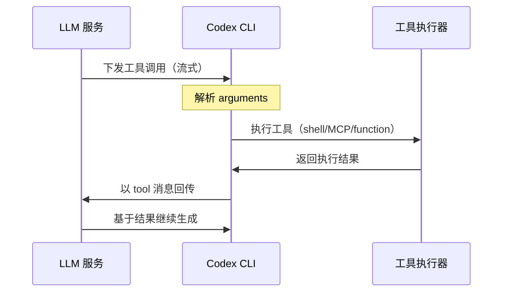

# Codex LLM 集成架构概览

## 系统本质与设计哲学

Codex LLM 集成系统是一个**协议抽象与工具统一**的集成框架，其核心使命是：

> **在保持协议灵活性的前提下，为各种 LLM 提供商提供统一的集成体验**

### 设计原则

1. **协议无关性**：支持 Responses API 与 Chat Completions API，无缝切换
2. **提供商抽象**：通过配置驱动，无代码接入新的 LLM 服务
3. **事件统一化**：将不同协议的 SSE 事件映射为统一的 `ResponseEvent`
4. **工具生态化**：集成 function、shell、MCP 等多种工具执行环境
5. **流式优先**：全链路流式处理，保证实时响应体验

## 系统架构全景

```mermaid
graph TB
    User[用户输入] --> Config[配置解析]
    Config --> Prompt[Prompt 组装]
    Prompt --> Wire[Wire API 选择]
    
    Wire --> |wire_api="responses"| ResponsesAPI[Responses API]
    Wire --> |wire_api="chat"| ChatAPI[Chat Completions API]
    
    ResponsesAPI --> SSE1[SSE 事件流]
    ChatAPI --> SSE2[SSE 事件流]
    
    SSE1 --> EventMap[事件映射与聚合]
    SSE2 --> EventMap
    
    EventMap --> ResponseEvent[统一 ResponseEvent]
    ResponseEvent --> ToolExec[工具调用执行]
    ToolExec --> |function/shell/MCP| LocalExec[本地执行环境]
    
    ResponseEvent --> Output[流式响应输出]
```

## 核心调用链路详解

### 1. 配置与上下文解析
**位置**：`core/src/config.rs`

```rust
// 配置优先级（高 → 低）
1. 命令行旗标：--model o3
2. 通用覆盖：--config model_providers.xxx.wire_api="chat" 
3. ~/.codex/config.toml
```

**关键决策点**：
- `model` → `ModelFamily` 映射（决定特性支持）
- `model_provider` 选择（决定协议与网络参数）

### 2. Prompt 组装策略
**位置**：`core/src/client_common.rs`

```rust
// Prompt 构成
system_prompt: prompt.md + 可选覆盖
+ conversation_history: ResponseItem[]  
+ tool_definitions: OpenAI Tools JSON
```

**智能合并**：
- 历史对话上下文管理
- 工具定义注入与版本控制
- 模型家族特定的指令适配

### 3. Wire API 协议选择
**位置**：`core/src/model_provider_info.rs`

| 协议类型 | 端点 | 特点 | 适用场景 |
|---------|------|------|----------|
| **Responses API** | `/v1/responses` | 事件语义丰富，支持推理/自定义工具 | 需要完整语义，支持多种工具类型 |
| **Chat Completions** | `/v1/chat/completions` | 生态兼容性最好，仅支持 function 工具 | 标准 LLM 集成，最大兼容性 |

**协议转换**：系统支持双向转换，Codex 自动处理协议差异

### 4. HTTP 请求与 SSE 处理
**位置**：`core/src/client.rs`、`core/src/chat_completions.rs`

**统一处理机制**：
- 鉴权策略：Bearer Token + 可选组织/项目头
- 重试策略：请求级 + 流式重连，支持 `Retry-After`
- 超时管理：空闲超时 + 全局超时
- 错误聚合：4xx/5xx 统一错误处理

### 5. 事件映射与聚合
**核心抽象**：`ResponseEvent` 枚举

```rust
pub enum ResponseEvent {
    Created,                                    // 会话创建
    OutputTextDelta(String),                   // 文本增量  
    ReasoningDelta(String),                    // 推理增量
    OutputItemDone(ResponseItem),              // 完整输出项
    Completed { response_id, token_usage },    // 回合结束
    WebSearchCallBegin { call_id },           // Web搜索开始
}
```

**映射策略**：
- **Responses → ResponseEvent**：直接语义映射
- **Chat → ResponseEvent**：增量聚合 + 完成时机合成

### 6. 工具调用执行生命周期



## 关键技术决策

### 1. 协议抽象设计

**问题**：如何统一 Responses 与 Chat 两种截然不同的协议？

**解决方案**：
- **上行统一**：通过 `ResponseEvent` 枚举抽象差异
- **下行适配**：自动协议转换与字段映射
- **语义保持**：确保转换过程中语义完整性

### 2. 工具系统设计

**问题**：如何支持多种工具类型（function/shell/MCP）的统一管理？

**解决方案**：
- **JSON Schema 子集**：标准化工具描述格式
- **执行生命周期**：统一的调用-执行-回调模式
- **协议适配**：Chat 仅 function，Responses 全工具类型

### 3. 流式处理设计

**问题**：如何保证流式处理的可靠性与性能？

**解决方案**：
- **增量聚合**：支持分片事件的智能合并
- **状态管理**：维护流式状态与完成语义
- **错误恢复**：流断开重连 + 空闲超时保护

## 扩展点与可替换组件

### 1. Provider 扩展
```toml
# 无代码接入新 Provider
[model_providers.your-provider]
name = "Your Provider"
base_url = "https://api.your-provider.com/v1"
wire_api = "chat"  # 或 "responses"
```

### 2. 工具扩展
- **MCP 工具**：通过 MCP 协议自动发现与注册
- **自定义工具**：通过 JSON Schema 定义新工具
- **内置工具**：shell、plan、apply_patch、view_image

### 3. 模型家族扩展
```rust
// 新模型家族特性定义
ModelFamily {
    reasoning_support: bool,      // 是否支持推理模式
    verbosity_levels: Vec<Level>, // 支持的详细程度
    preferred_tools: Vec<Tool>,   // 偏好的工具类型
}
```

## 性能与可靠性

### 性能优化
- **连接复用**：HTTP/2 连接池
- **缓存策略**：Prompt 缓存 + 配置缓存
- **流式处理**：零拷贝 + 背压控制

### 可靠性保障
- **多层重试**：请求级 + 流级重试
- **优雅降级**：协议降级 + 工具降级
- **监控告警**：错误率 + 延迟监控

## 代码导航

### 核心模块定位
- **事件类型定义**：`codex-rs/core/src/client_common.rs`
- **客户端入口**：`codex-rs/core/src/client.rs`
- **Chat 处理**：`codex-rs/core/src/chat_completions.rs`
- **Provider 配置**：`codex-rs/core/src/model_provider_info.rs`
- **工具系统**：`codex-rs/core/src/openai_tools.rs`
- **模型家族**：`codex-rs/core/src/model_family.rs`

### 数据流关键点
1. **Config 解析**：`Config` → `ModelProvider` + `ModelFamily`
2. **Prompt 组装**：系统指令 + 历史 + 工具定义
3. **协议选择**：`wire_api` → API 端点 + 请求格式
4. **事件映射**：SSE → `ResponseEvent` → 上层处理
5. **工具执行**：`FunctionCall` → 本地执行 → `ToolResult`

---

## 下一步深入

- **[API 规范](./02-api-specifications.md)**：深入了解 Wire API 协议细节
- **[配置指南](./03-configuration-guide.md)**：掌握 Provider 配置与优化
- **[工具集成](./04-tools-integration.md)**：理解工具系统设计与扩展

这个架构为 Codex 提供了强大的扩展性和兼容性，使其能够适应不断变化的 LLM 生态环境。