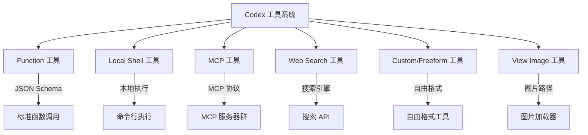
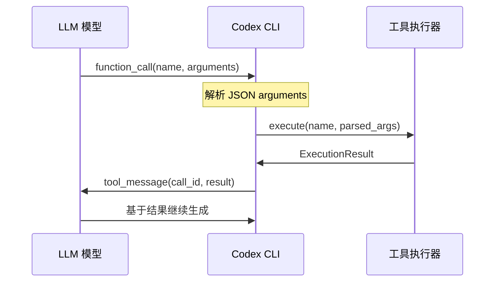

# 工具集成详解

## 工具系统概述

Codex 采用**统一工具抽象**设计，通过 JSON Schema 子集标准化工具描述，支持多种工具类型的无缝集成与执行。

### 工具类型全景



### 协议支持矩阵

| 工具类型 | Responses API | Chat Completions API | 说明 |
|----------|---------------|---------------------|------|
| **function** | ✅ 原生支持 | ✅ 原生支持 | 标准函数调用，兼容性最好 |
| **local_shell** | ✅ 原生支持 | ❌ 转换为 function | 本地 Shell 命令执行 |
| **web_search** | ✅ 原生支持 | ❌ 转换为 function | Web 搜索功能 |
| **custom/freeform** | ✅ 原生支持 | ❌ 转换为 function | 自由格式工具 |
| **view_image** | ✅ 原生支持 | ❌ 转换为 function | 图片查看工具 |

## JSON Schema 子集规范

Codex 使用受限的 JSON Schema 子集来确保跨协议的兼容性：

### 支持的类型

```json
{
  "type": "object",
  "properties": {
    "string_field": {"type": "string"},
    "number_field": {"type": "number"},  // 包括 integer
    "boolean_field": {"type": "boolean"},
    "array_field": {
      "type": "array", 
      "items": {"type": "string"}  // 缺失时默认 string
    },
    "object_field": {
      "type": "object",
      "properties": {
        "nested": {"type": "string"}
      },
      "required": ["nested"],
      "additionalProperties": false
    }
  },
  "required": ["string_field"],
  "additionalProperties": true
}
```

### 归一化策略

```rust
// core/src/openai_tools.rs: sanitize_json_schema
fn sanitize_json_schema(schema: JsonValue) -> JsonSchema {
    // 1. 类型推断：缺失 type 时根据其他字段推断
    let inferred_type = match schema {
        _ if schema.contains("properties") => "object",
        _ if schema.contains("items") => "array", 
        _ if schema.contains("enum") => infer_from_enum(&schema),
        _ => "string"  // 默认类型
    };
    
    // 2. integer → number 归一化
    let normalized_type = match inferred_type {
        "integer" => "number",
        other => other
    };
    
    // 3. 递归处理嵌套 schema
    // 4. 清理不支持的字段
}
```

## Function 工具详解

### 工具定义格式

```json
{
  "type": "function",
  "function": {
    "name": "apply_patch",
    "description": "Apply a patch to modify files in the codebase",
    "parameters": {
      "type": "object",
      "properties": {
        "patch": {
          "type": "string",
          "description": "The patch content in unified diff format"
        },
        "confirm": {
          "type": "boolean", 
          "description": "Whether to apply without confirmation",
          "default": false
        }
      },
      "required": ["patch"]
    }
  }
}
```

### 执行生命周期



### 内置 Function 工具

#### 1. apply_patch 工具
```json
{
  "name": "apply_patch",
  "description": "Apply unified diff patch to modify files",
  "parameters": {
    "type": "object", 
    "properties": {
      "patch": {"type": "string"},
      "confirm": {"type": "boolean", "default": false}
    },
    "required": ["patch"]
  }
}
```

#### 2. shell 工具（function 形态）
```json
{
  "name": "shell", 
  "description": "Execute shell command",
  "parameters": {
    "type": "object",
    "properties": {
      "command": {
        "type": "array",
        "items": {"type": "string"}
      },
      "description": {"type": "string"}
    },
    "required": ["command"]
  }
}
```

## Local Shell 工具

### 原生 Shell 工具（Responses API）

```json
{
  "type": "local_shell",
  "name": "shell",
  "description": "Execute local shell commands with approval policy"
}
```

**执行流程**：
1. 模型发起 `local_shell_call`
2. Codex 根据批准策略决定是否执行
3. 执行结果作为 `local_shell_call_output` 返回

### 批准策略配置

```rust
pub enum ApprovalPolicy {
    None,        // 无需批准，直接执行
    Required,    // 必须用户批准
    Sandbox,     // 沙箱模式执行
}
```

### 安全沙箱集成

```toml
# 配置文件示例
[tool_config]
approval_policy = "sandbox"  # none | required | sandbox
sandbox_policy = "docker"    # docker | vm | chroot
```

**沙箱执行示例**：
```bash
# Docker 沙箱
docker run --rm -v "$(pwd)":/workspace -w /workspace \
  ubuntu:latest bash -c "ls -la"

# 权限控制
docker run --rm --user 1000:1000 --read-only \
  -v "$(pwd)":/workspace:ro ubuntu:latest \
  bash -c "echo 'Safe read-only execution'"
```

## MCP 工具集成

### MCP (Model Context Protocol) 简介

MCP 是一种标准化协议，用于 AI 助手与外部工具/资源的集成。Codex 通过 MCP 实现了可扩展的工具生态。

### MCP 服务器注册

```rust
// 自动发现与注册 MCP 工具
async fn register_mcp_tools() -> Result<Vec<Tool>> {
    let servers = discover_mcp_servers().await?;
    let mut tools = Vec::new();
    
    for server in servers {
        let server_tools = server.list_tools().await?;
        for tool in server_tools {
            // 转换为 OpenAI 工具格式
            let openai_tool = mcp_tool_to_openai_tool(&tool);
            tools.push(openai_tool);
        }
    }
    
    // 按名称排序以稳定 Prompt（提升缓存命中）
    tools.sort_by(|a, b| a.name.cmp(&b.name));
    Ok(tools)
}
```

### MCP 工具命名

```rust
// 全限定名格式：server/tool_name
fn get_qualified_tool_name(server: &str, tool: &str) -> String {
    format!("{}/{}", server, tool)
}

// 示例：
// - "filesystem/read_file" 
// - "database/query_users"
// - "api_client/make_request"
```

### MCP Schema 映射

```rust
// 将 MCP ToolInputSchema 转换为 OpenAI 工具格式
fn mcp_tool_to_openai_tool(mcp_tool: &MCPTool) -> ResponsesApiTool {
    ResponsesApiTool {
        type_: "function".to_string(),
        name: get_qualified_tool_name(&mcp_tool.server, &mcp_tool.name),
        description: mcp_tool.description.clone(),
        parameters: sanitize_json_schema(mcp_tool.input_schema),
    }
}
```

## Web Search 工具

### 工具定义

```json
{
  "type": "web_search", 
  "name": "web_search",
  "description": "Search the web for current information"
}
```

### 使用配置

```toml
[tool_config]
tools_web_search_request = true  # 启用 web_search 工具
```

### 执行示例

```json
// 模型发起搜索
{
  "type": "web_search_call",
  "query": "Rust async programming best practices 2024",
  "call_id": "ws_1"
}

// Codex 返回结果
{
  "type": "web_search_call_output", 
  "call_id": "ws_1",
  "results": [
    {
      "title": "Async Rust Programming Guide",
      "url": "https://example.com/rust-async",
      "snippet": "Best practices for async programming..."
    }
  ]
}
```

## Custom/Freeform 工具

### 自由格式工具定义

```json
{
  "type": "custom",
  "name": "custom_analysis", 
  "description": "Perform custom data analysis with flexible input format",
  "input_format": "freeform"
}
```

### 使用场景
- **复杂分析**：需要自然语言描述的分析任务
- **创意工作**：设计、写作、头脑风暴等
- **领域特定**：专业领域的特殊工具

### 执行流程
```json
// 模型调用
{
  "type": "custom_tool_call",
  "name": "custom_analysis",
  "input": "Please analyze the performance trends in the attached dataset focusing on seasonal patterns and growth indicators.",
  "call_id": "ct_1"
}

// 执行结果
{
  "type": "custom_tool_call_output",
  "call_id": "ct_1", 
  "output": "Analysis results: The dataset shows strong seasonal patterns with 23% growth in Q4..."
}
```

## View Image 工具

### 工具定义

```json
{
  "type": "view_image",
  "name": "view_image",
  "description": "Load and analyze images from local file paths",
  "parameters": {
    "type": "object",
    "properties": {
      "image_path": {
        "type": "string",
        "description": "Path to the image file"
      }
    },
    "required": ["image_path"]
  }
}
```

### 支持格式
- **图片格式**：PNG, JPEG, GIF, WebP, BMP
- **路径类型**：绝对路径、相对路径
- **安全检查**：路径遍历攻击防护

### 使用示例

```json
// 模型调用
{
  "type": "view_image_call",
  "image_path": "/path/to/diagram.png",
  "call_id": "vi_1"
}

// Codex 响应
{
  "type": "view_image_call_output",
  "call_id": "vi_1",
  "image_data": "data:image/png;base64,iVBORw0KGgoAAAANSUhEUg...",
  "metadata": {
    "width": 800,
    "height": 600,
    "format": "PNG"
  }
}
```

## 工具协议转换

### Chat ↔ Responses 转换策略

```rust
// Responses 工具 → Chat 工具转换
fn create_tools_json_for_chat_completions_api(
    responses_tools: Vec<ResponsesApiTool>
) -> Vec<ChatCompletionsTool> {
    responses_tools
        .into_iter()
        .filter_map(|tool| {
            // 只保留 function 类型工具
            if tool.type_ == "function" {
                Some(ChatCompletionsTool {
                    type_: "function".to_string(),
                    function: ChatCompletionsFunction {
                        name: tool.name,
                        description: tool.description,
                        parameters: tool.parameters,
                    }
                })
            } else {
                None  // 过滤非 function 工具
            }
        })
        .collect()
}
```

### 工具调用映射

| Responses 工具调用 | Chat 工具调用 | 转换策略 |
|-------------------|---------------|----------|
| `local_shell_call` | `function_call(name="shell")` | 转换为 function 调用 |
| `web_search_call` | `function_call(name="web_search")` | 转换为 function 调用 |
| `custom_tool_call` | `function_call(name=tool_name)` | 转换为 function 调用 |
| `function_call` | `function_call` | 直接映射 |

## 工具配置管理

### 全局工具配置

```rust
pub struct ToolsConfig {
    pub include_plan_tool: bool,              // 是否包含计划工具
    pub include_apply_patch_tool: bool,       // 是否包含补丁工具  
    pub tools_web_search_request: bool,       // 是否包含搜索工具
    pub include_view_image_tool: bool,        // 是否包含图片工具
    pub use_experimental_streamable_shell_tool: bool, // 实验性流式 shell
    pub approval_policy: ApprovalPolicy,      // 批准策略
    pub sandbox_policy: SandboxPolicy,        // 沙箱策略
}
```

### 模型家族相关配置

```rust
// 不同模型家族的工具偏好
impl ModelFamily {
    fn get_preferred_tools(&self) -> ToolPreferences {
        match self {
            ModelFamily::Gpt5 => ToolPreferences {
                prefer_local_shell: true,
                apply_patch_format: PatchFormat::Unified,
                reasoning_tools: true,
            },
            ModelFamily::Claude3 => ToolPreferences {
                prefer_function_tools: true,
                apply_patch_format: PatchFormat::Simple, 
                reasoning_tools: false,
            },
            // ...
        }
    }
}
```

### 运行时工具组装

```rust
// 核心工具组装逻辑
pub fn get_openai_tools(
    config: &Config,
    model_family: &ModelFamily,
    mcp_tools: Vec<MCPTool>
) -> Result<Vec<ResponsesApiTool>> {
    let mut tools = Vec::new();
    
    // 1. 内置工具
    if config.tools.include_apply_patch_tool {
        tools.push(create_apply_patch_tool(model_family));
    }
    
    if config.tools.include_plan_tool {
        tools.push(create_plan_tool());
    }
    
    // 2. Shell 工具（根据模型家族选择形态）
    if model_family.prefers_local_shell() {
        tools.push(create_local_shell_tool(&config.tools));
    } else {
        tools.push(create_shell_function_tool(&config.tools));
    }
    
    // 3. Web 搜索工具
    if config.tools.tools_web_search_request {
        tools.push(create_web_search_tool());
    }
    
    // 4. 图片工具
    if config.tools.include_view_image_tool {
        tools.push(create_view_image_tool());
    }
    
    // 5. MCP 工具
    for mcp_tool in mcp_tools {
        tools.push(mcp_tool_to_openai_tool(&mcp_tool));
    }
    
    // 6. 按名称排序（稳定 Prompt，提升缓存命中）
    tools.sort_by(|a, b| a.name.cmp(&b.name));
    
    Ok(tools)
}
```

## 工具安全与权限

### 权限控制矩阵

| 工具类型 | 权限级别 | 安全措施 |
|----------|----------|----------|
| **function** | 用户定义 | JSON Schema 验证 |
| **local_shell** | 高危 | 批准策略 + 沙箱 |
| **web_search** | 中等 | 搜索内容过滤 |
| **custom** | 中等 | 输入内容检查 |
| **view_image** | 低 | 路径遍历防护 |

### 安全最佳实践

1. **最小权限原则**：只启用必需的工具
2. **沙箱执行**：高风险工具在隔离环境执行
3. **输入验证**：严格的参数格式检查
4. **输出过滤**：敏感信息脱敏处理
5. **审计日志**：完整的工具调用记录

### 配置示例

```toml
[tool_security]
# 批准策略
approval_policy = "required"  # none | required | sandbox

# 沙箱配置
sandbox_policy = "docker"     # docker | vm | chroot

# 权限限制
max_shell_commands_per_session = 10
max_file_access_size = "100MB"
allowed_network_domains = ["api.github.com", "docs.rust-lang.org"]

# 审计配置  
audit_log_enabled = true
audit_log_path = "~/.codex/audit.log"
```

## 工具扩展开发

### 自定义 Function 工具

```rust
// 定义新的 function 工具
pub fn create_custom_function_tool() -> ResponsesApiTool {
    ResponsesApiTool {
        type_: "function".to_string(),
        name: "analyze_code".to_string(),
        description: "Analyze code quality and suggest improvements".to_string(),
        parameters: json!({
            "type": "object",
            "properties": {
                "file_path": {
                    "type": "string",
                    "description": "Path to the code file"
                },
                "analysis_type": {
                    "type": "string", 
                    "enum": ["quality", "performance", "security"],
                    "description": "Type of analysis to perform"
                }
            },
            "required": ["file_path", "analysis_type"]
        })
    }
}
```

### MCP 服务器开发

```typescript
// 简单的 MCP 服务器示例
import { MCPServer } from '@mcp/server';

const server = new MCPServer({
  name: 'custom-tools',
  version: '1.0.0'
});

// 注册工具
server.registerTool({
  name: 'format_code',
  description: 'Format code using prettier/rustfmt',
  inputSchema: {
    type: 'object',
    properties: {
      file_path: { type: 'string' },
      language: { type: 'string', enum: ['rust', 'typescript', 'python'] }
    },
    required: ['file_path', 'language']
  }
}, async (input) => {
  // 实现工具逻辑
  const { file_path, language } = input;
  const result = await formatCode(file_path, language);
  return { formatted: true, changes: result.changes };
});

server.start();
```

---

## 下一步
- **[实现指南](./05-implementation-guide.md)**：构建支持完整工具集成的代理
- **[测试验证](./06-testing-validation.md)**：验证工具调用的正确性
- **[API 规范](./02-api-specifications.md)**：回顾工具调用的协议细节

Codex 的工具系统为 AI 助手提供了强大的外部能力扩展，通过标准化的接口和安全的执行环境，实现了工具生态的良性发展。