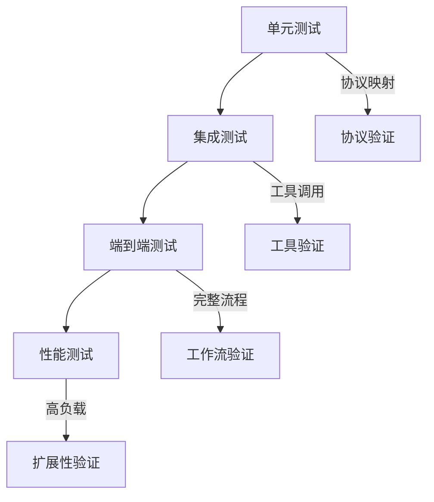

# 测试验证指南

## 验证策略概述

基于 Codex LLM 集成系统的复杂性，我们采用**分层验证**策略，从底层协议到端到端集成的系统性验证：



### 验证优先级

1. **协议兼容性**：确保 Wire API 转换正确性
2. **工具调用**：验证分片聚合与并发执行
3. **错误处理**：限流与重试策略有效性
4. **性能基准**：延迟与吞吐量指标
5. **端到端场景**：真实使用场景覆盖

## Top 3 关键验证点

基于系统架构分析，我们识别出三个最关键的不确定性点，需要重点验证：

### 1. Chat → Responses 语义合成完整性

**核心假设**：只要代理正确合成 `response.output_text.delta` 与 `response.completed` 事件，Codex 就能正常推进对话回合。

**风险评估**：
- 🔴 **高风险**：缺少 `response.completed` 会导致 Codex 判定流异常
- 🟡 **中风险**：事件顺序错乱可能影响 UI 渲染
- 🟢 **低风险**：可选事件缺失通常不影响核心功能

### 2. 工具调用分片聚合准确性

**核心假设**：按 `index` 正确聚合 `tool_calls` 分片，在 `finish_reason=tool_calls` 时输出完整的 `function_call` 事件。

**风险评估**：
- 🔴 **高风险**：`arguments` 拼接错误导致非法 JSON
- 🔴 **高风险**：多并发工具的 `index` 混淆导致数据污染
- 🟡 **中风险**：工具调用 ID 不匹配影响工具回合

### 3. 错误与限流透传协同

**核心假设**：代理透传 `429`/`5xx` 错误及 `Retry-After` 头，Codex 会据此退避重试。

**风险评估**：
- 🟡 **中风险**：未透传 `Retry-After` 导致次优退避策略
- 🟢 **低风险**：错误信息不完整影响调试体验

## 最小验证实验 (MVP)

针对每个关键点，设计可执行的本地验证实验：

### 实验 E1：文本语义闭环验证

**目标**：验证最基本的对话回合能否正常完成

#### 1. 环境准备

```bash
# 创建测试目录
mkdir -p codex-validation/e1-text-loop
cd codex-validation/e1-text-loop
```

#### 2. Mock Chat 上游

```typescript
// mock/chat-minimal.ts
import { createServer } from 'node:http';

const server = createServer((req, res) => {
  if (req.url === '/v1/chat/completions' && req.method === 'POST') {
    res.writeHead(200, {
      'Content-Type': 'text/event-stream',
      'Cache-Control': 'no-cache',
      'Connection': 'keep-alive'
    });

    // 模拟标准 Chat 流
    const events = [
      { id: 'chat-1', choices: [{ delta: { content: 'Hello' } }] },
      { id: 'chat-1', choices: [{ delta: { content: ' from' } }] },
      { id: 'chat-1', choices: [{ delta: { content: ' Codex!' } }] },
      { id: 'chat-1', choices: [{ finish_reason: 'stop' }] }
    ];

    events.forEach((event, i) => {
      setTimeout(() => {
        res.write(`data: ${JSON.stringify(event)}\n\n`);
        if (i === events.length - 1) {
          res.end('data: [DONE]\n\n');
        }
      }, i * 100);
    });
  } else {
    res.writeHead(404).end('Not Found');
  }
});

server.listen(3100, () => {
  console.log('✅ Mock Chat server running on :3100');
});
```

#### 3. 启动代理服务

```bash
# 环境配置
export UPSTREAM_BASE_URL=http://localhost:3100
export UPSTREAM_SUPPORTS_RESPONSES=false
export LOG_LEVEL=debug

# 启动服务（并行）
node mock/chat-minimal.ts &
node dist/server.js &
```

#### 4. 验证调用

```bash
# 调用 Responses 端点（经过桥接转换）
curl -N 'http://localhost:3000/v1/responses' \
  -H 'Content-Type: application/json' \
  -d '{
    "model": "test-model",
    "instructions": "You are a helpful assistant",
    "input": []
  }' | tee e1-output.log
```

#### 5. 验证标准

**必须包含的事件序列**：
```json
{"type": "response.output_text.delta", "delta": "Hello"}
{"type": "response.output_text.delta", "delta": " from"}  
{"type": "response.output_text.delta", "delta": " Codex!"}
{"type": "response.output_item.done", "item": {"type": "message", "role": "assistant", "content": [{"type": "output_text", "text": "Hello from Codex!"}]}}
{"type": "response.completed", "id": "chat-1"}
```

**验证脚本**：
```bash
#!/bin/bash
# validate-e1.sh

LOG_FILE="e1-output.log"

# 检查必需事件
check_event() {
  local pattern="$1"
  local description="$2"
  
  if grep -q "$pattern" "$LOG_FILE"; then
    echo "✅ $description"
  else
    echo "❌ $description"
    return 1
  fi
}

echo "🔍 验证实验 E1 结果..."

check_event "response.output_text.delta" "文本增量事件"
check_event "response.output_item.done.*message" "完整消息事件"  
check_event "response.completed" "完成事件"

# 检查事件顺序
if grep -n "response\." "$LOG_FILE" | grep -E "(delta.*Hello|completed)" | head -1 | grep -q "delta"; then
  echo "✅ 事件顺序正确"
else
  echo "❌ 事件顺序错误"
fi

echo "📊 实验 E1 验证完成"
```

### 实验 E2：工具调用分片聚合验证

**目标**：验证多并发工具调用的分片拼接与输出正确性

#### 1. Mock 工具调用上游

```typescript
// mock/chat-tools.ts
import { createServer } from 'node:http';

const server = createServer((req, res) => {
  if (req.url === '/v1/chat/completions' && req.method === 'POST') {
    res.writeHead(200, {
      'Content-Type': 'text/event-stream',
      'Cache-Control': 'no-cache',
      'Connection': 'keep-alive'
    });

    // 模拟复杂的并发工具调用
    const events = [
      // 工具 0 开始
      {
        id: 'chat-tools-1',
        choices: [{
          delta: {
            tool_calls: [{
              index: 0,
              id: 'call_abc123',
              function: { name: 'apply_patch', arguments: '' }
            }]
          }
        }]
      },
      
      // 工具 1 开始
      {
        id: 'chat-tools-1', 
        choices: [{
          delta: {
            tool_calls: [{
              index: 1,
              id: 'call_def456',
              function: { name: 'shell', arguments: '' }
            }]
          }
        }]
      },

      // 工具 0 参数分片 1
      {
        id: 'chat-tools-1',
        choices: [{
          delta: {
            tool_calls: [{
              index: 0,
              function: { arguments: '{"patch": "diff --git' }
            }]
          }
        }]
      },

      // 工具 1 参数分片 1  
      {
        id: 'chat-tools-1',
        choices: [{
          delta: {
            tool_calls: [{
              index: 1,
              function: { arguments: '{"command": ["ls"' }
            }]
          }
        }]
      },

      // 工具 0 参数分片 2（完成）
      {
        id: 'chat-tools-1',
        choices: [{
          delta: {
            tool_calls: [{
              index: 0,
              function: { arguments: ' a/file.txt\\n+new line"}' }
            }]
          }
        }]
      },

      // 工具 1 参数分片 2（完成）
      {
        id: 'chat-tools-1',
        choices: [{
          delta: {
            tool_calls: [{
              index: 1,
              function: { arguments: ', "-la"]}' }
            }]
          }
        }]
      },

      // 所有工具完成
      {
        id: 'chat-tools-1',
        choices: [{ finish_reason: 'tool_calls' }]
      }
    ];

    events.forEach((event, i) => {
      setTimeout(() => {
        res.write(`data: ${JSON.stringify(event)}\n\n`);
        if (i === events.length - 1) {
          res.end('data: [DONE]\n\n');
        }
      }, i * 50);
    });
  } else {
    res.writeHead(404).end('Not Found');
  }
});

server.listen(3101, () => {
  console.log('✅ Mock Tools server running on :3101');
});
```

#### 2. 执行验证

```bash
export UPSTREAM_BASE_URL=http://localhost:3101
node mock/chat-tools.ts &
node dist/server.js &

curl -N 'http://localhost:3000/v1/responses' \
  -H 'Content-Type: application/json' \
  -d '{
    "model": "test-model",
    "instructions": "You are a helpful assistant", 
    "input": []
  }' | tee e2-output.log
```

#### 3. 验证标准

**预期输出项**：
```json
{
  "type": "response.output_item.done",
  "item": {
    "type": "function_call",
    "name": "apply_patch",
    "call_id": "call_abc123", 
    "arguments": "{\"patch\": \"diff --git a/file.txt\\n+new line\"}"
  }
}

{
  "type": "response.output_item.done", 
  "item": {
    "type": "function_call",
    "name": "shell",
    "call_id": "call_def456",
    "arguments": "{\"command\": [\"ls\", \"-la\"]}"
  }
}
```

**验证脚本**：
```bash
#!/bin/bash
# validate-e2.sh

LOG_FILE="e2-output.log"

echo "🔍 验证实验 E2 工具调用..."

# 验证工具调用数量
TOOL_CALLS=$(grep -c "response.output_item.done.*function_call" "$LOG_FILE")
if [ "$TOOL_CALLS" -eq 2 ]; then
  echo "✅ 工具调用数量正确: $TOOL_CALLS"
else
  echo "❌ 工具调用数量错误: $TOOL_CALLS (期望: 2)"
fi

# 验证 arguments JSON 有效性
grep "response.output_item.done.*function_call" "$LOG_FILE" | while read -r line; do
  ARGS=$(echo "$line" | jq -r '.item.arguments' 2>/dev/null)
  if echo "$ARGS" | jq empty 2>/dev/null; then
    echo "✅ 工具参数 JSON 有效: $(echo "$ARGS" | jq -c .)"
  else
    echo "❌ 工具参数 JSON 无效: $ARGS"
  fi
done

# 验证具体工具
if grep -q '"name": "apply_patch"' "$LOG_FILE" && grep -q '"name": "shell"' "$LOG_FILE"; then
  echo "✅ 两个预期工具都存在"
else
  echo "❌ 工具类型不匹配"
fi

echo "📊 实验 E2 验证完成"
```

### 实验 E3：错误透传与重试协同验证

**目标**：验证限流错误的正确透传与 Codex 的退避行为

#### 1. Mock 429 限流服务

```typescript
// mock/chat-429.ts
import { createServer } from 'node:http';

let requestCount = 0;

const server = createServer((req, res) => {
  if (req.url === '/v1/chat/completions' && req.method === 'POST') {
    requestCount++;
    
    // 前 2 次请求返回 429，第 3 次成功
    if (requestCount <= 2) {
      res.writeHead(429, {
        'Content-Type': 'application/json',
        'Retry-After': '2'  // 建议 2 秒后重试
      });
      
      res.end(JSON.stringify({
        error: {
          type: 'rate_limit',
          message: 'Too many requests',
          code: 'rate_limit_exceeded'
        }
      }));
    } else {
      // 第 3 次请求成功
      res.writeHead(200, {
        'Content-Type': 'text/event-stream',
        'Cache-Control': 'no-cache',
        'Connection': 'keep-alive'
      });

      res.write('data: {"id": "success", "choices": [{"delta": {"content": "Success after retry!"}}]}\n\n');
      res.end('data: [DONE]\n\n');
    }
  } else {
    res.writeHead(404).end('Not Found');
  }
});

server.listen(3102, () => {
  console.log('✅ Mock 429 server running on :3102');
  console.log('📊 Request count will be tracked');
});
```

#### 2. 代理透传增强

确保代理正确透传错误头：

```typescript
// src/lib/upstream-error-handler.ts
export async function handleUpstreamError(
  upstreamResponse: Response,
  res: express.Response,
  logger: any
): Promise<void> {
  const statusCode = upstreamResponse.status;
  
  // 🔑 关键：透传重要的头
  const retryAfter = upstreamResponse.headers.get('retry-after');
  if (retryAfter) {
    res.set('Retry-After', retryAfter);
  }

  const contentType = upstreamResponse.headers.get('content-type');
  if (contentType) {
    res.set('Content-Type', contentType);
  }

  try {
    const errorBody = await upstreamResponse.text();
    logger.warn({ statusCode, retryAfter, errorBody }, 'Upstream error');
    
    res.status(statusCode).send(errorBody);
  } catch (err) {
    res.status(statusCode).json({
      error: {
        message: upstreamResponse.statusText,
        type: 'upstream_error'
      }
    });
  }
}
```

#### 3. 执行验证

```bash
export UPSTREAM_BASE_URL=http://localhost:3102
node mock/chat-429.ts &
node dist/server.js &

# 单次调用，观察错误透传
curl -i 'http://localhost:3000/v1/chat/completions' \
  -H 'Content-Type: application/json' \
  -d '{
    "model": "test-model",
    "messages": [{"role": "user", "content": "test"}],
    "stream": true
  }' | tee e3-error-output.log
```

#### 4. 验证标准

**预期行为**：
1. 第一次请求返回 `HTTP 429` + `Retry-After: 2`
2. Codex 应该等待至少 2 秒后重试
3. 第三次请求成功返回内容

**验证脚本**：
```bash
#!/bin/bash
# validate-e3.sh

LOG_FILE="e3-error-output.log"

echo "🔍 验证实验 E3 错误处理..."

# 检查 HTTP 状态码
if grep -q "HTTP/1.1 429" "$LOG_FILE"; then
  echo "✅ 429 状态码正确透传"
else
  echo "❌ 429 状态码未透传"
fi

# 检查 Retry-After 头
if grep -q "Retry-After: 2" "$LOG_FILE"; then
  echo "✅ Retry-After 头正确透传"
else
  echo "❌ Retry-After 头未透传"
fi

# 检查错误体格式
if grep -q "rate_limit" "$LOG_FILE"; then
  echo "✅ 错误体格式正确"
else
  echo "❌ 错误体格式不正确"  
fi

echo "📊 实验 E3 验证完成"
```

## 集成测试套件

### 测试框架搭建

```typescript
// test/integration/test-framework.ts
export interface TestScenario {
  name: string;
  description: string;
  setup: () => Promise<TestEnvironment>;
  execute: (env: TestEnvironment) => Promise<TestResult>;
  validate: (result: TestResult) => Promise<ValidationResult>;
  cleanup: (env: TestEnvironment) => Promise<void>;
}

export interface TestEnvironment {
  mockServer: MockServer;
  proxyServer: ProxyServer;
  baseUrl: string;
}

export class IntegrationTestRunner {
  private scenarios: TestScenario[] = [];

  addScenario(scenario: TestScenario): void {
    this.scenarios.push(scenario);
  }

  async runAll(): Promise<TestSummary> {
    const results: TestScenarioResult[] = [];

    for (const scenario of this.scenarios) {
      console.log(`🧪 Running: ${scenario.name}`);
      
      const result = await this.runScenario(scenario);
      results.push(result);
      
      const status = result.success ? '✅' : '❌';
      console.log(`${status} ${scenario.name}: ${result.message}`);
    }

    return this.generateSummary(results);
  }

  private async runScenario(scenario: TestScenario): Promise<TestScenarioResult> {
    let env: TestEnvironment | null = null;
    
    try {
      env = await scenario.setup();
      const result = await scenario.execute(env);
      const validation = await scenario.validate(result);
      
      return {
        name: scenario.name,
        success: validation.success,
        message: validation.message,
        duration: result.duration,
        details: validation.details
      };
    } catch (error) {
      return {
        name: scenario.name,
        success: false,
        message: error.message,
        duration: 0,
        details: { error: error.stack }
      };
    } finally {
      if (env) {
        await scenario.cleanup(env);
      }
    }
  }
}
```

### 端到端测试场景

```typescript
// test/integration/e2e-scenarios.ts
import { TestScenario } from './test-framework';

// 场景 1：基本对话流程
export const basicChatScenario: TestScenario = {
  name: 'Basic Chat Flow',
  description: '验证基本的问答对话流程',
  
  async setup() {
    const mockServer = new MockServer(3200);
    await mockServer.start();
    
    // 配置标准对话响应
    mockServer.setupChatEndpoint([
      { content: 'Hello! How can I help you?' },
      { finish_reason: 'stop' }
    ]);

    const proxyServer = new ProxyServer({
      port: 3201,
      upstreamUrl: 'http://localhost:3200'
    });
    await proxyServer.start();

    return {
      mockServer,
      proxyServer,
      baseUrl: 'http://localhost:3201'
    };
  },

  async execute(env) {
    const startTime = Date.now();
    
    const response = await fetch(`${env.baseUrl}/v1/responses`, {
      method: 'POST',
      headers: { 'Content-Type': 'application/json' },
      body: JSON.stringify({
        model: 'test-model',
        instructions: 'You are a helpful assistant.',
        input: [{
          type: 'message',
          role: 'user', 
          content: [{ type: 'input_text', text: 'Hello' }]
        }]
      })
    });

    const events = await parseSSEResponse(response);
    
    return {
      statusCode: response.status,
      events,
      duration: Date.now() - startTime
    };
  },

  async validate(result) {
    const checks: ValidationCheck[] = [
      {
        name: 'HTTP Status',
        condition: result.statusCode === 200,
        message: `Expected 200, got ${result.statusCode}`
      },
      {
        name: 'Text Delta Events',
        condition: result.events.some(e => e.type === 'response.output_text.delta'),
        message: 'Should contain text delta events'
      },
      {
        name: 'Completion Event',
        condition: result.events.some(e => e.type === 'response.completed'),
        message: 'Should end with completion event'
      },
      {
        name: 'Response Time',
        condition: result.duration < 5000,
        message: `Response too slow: ${result.duration}ms`
      }
    ];

    const failed = checks.filter(c => !c.condition);
    
    return {
      success: failed.length === 0,
      message: failed.length === 0 
        ? 'All checks passed' 
        : `${failed.length} checks failed`,
      details: { checks, failedChecks: failed }
    };
  },

  async cleanup(env) {
    await env.mockServer.stop();
    await env.proxyServer.stop();
  }
};

// 场景 2：工具调用流程
export const toolCallScenario: TestScenario = {
  name: 'Tool Call Flow',
  description: '验证函数工具调用的完整流程',
  
  // 实现类似的结构...
};

// 场景 3：错误恢复
export const errorRecoveryScenario: TestScenario = {
  name: 'Error Recovery',
  description: '验证错误处理与重试机制',
  
  // 实现错误场景测试...
};
```

## 性能基准测试

### 负载测试配置

```typescript
// test/performance/load-test.ts
export interface LoadTestConfig {
  concurrency: number;
  duration: number;
  rampUpTime: number;
  targetRPS: number;
}

export class LoadTester {
  constructor(private config: LoadTestConfig) {}

  async run(targetUrl: string): Promise<LoadTestResults> {
    const results = new LoadTestResults();
    const startTime = Date.now();
    
    // 创建并发连接
    const workers = Array.from({ length: this.config.concurrency }, 
      () => this.createWorker(targetUrl, results)
    );

    // 运行测试
    await Promise.race([
      Promise.all(workers),
      this.timeout(this.config.duration)
    ]);

    results.finalize(Date.now() - startTime);
    return results;
  }

  private async createWorker(
    targetUrl: string, 
    results: LoadTestResults
  ): Promise<void> {
    while (!results.shouldStop) {
      const requestStart = Date.now();
      
      try {
        const response = await fetch(`${targetUrl}/v1/responses`, {
          method: 'POST',
          headers: { 'Content-Type': 'application/json' },
          body: JSON.stringify({
            model: 'test-model',
            instructions: 'You are a helpful assistant.',
            input: [{ 
              type: 'message', 
              role: 'user', 
              content: [{ type: 'input_text', text: 'Performance test' }]
            }]
          })
        });

        const duration = Date.now() - requestStart;
        results.recordRequest(response.status, duration);
        
      } catch (error) {
        results.recordError(error);
      }
      
      // 流量控制
      await this.delay(1000 / (this.config.targetRPS / this.config.concurrency));
    }
  }

  private timeout(ms: number): Promise<void> {
    return new Promise(resolve => setTimeout(resolve, ms));
  }

  private delay(ms: number): Promise<void> {
    return new Promise(resolve => setTimeout(resolve, ms));
  }
}

export class LoadTestResults {
  private requests: RequestResult[] = [];
  private errors: Error[] = [];
  public shouldStop = false;

  recordRequest(status: number, duration: number): void {
    this.requests.push({ status, duration, timestamp: Date.now() });
  }

  recordError(error: Error): void {
    this.errors.push(error);
  }

  finalize(totalDuration: number): void {
    this.shouldStop = true;
    
    // 计算统计指标
    this.stats = {
      totalRequests: this.requests.length,
      successfulRequests: this.requests.filter(r => r.status < 400).length,
      errorCount: this.errors.length,
      avgDuration: this.requests.reduce((sum, r) => sum + r.duration, 0) / this.requests.length,
      p95Duration: this.percentile(this.requests.map(r => r.duration), 0.95),
      p99Duration: this.percentile(this.requests.map(r => r.duration), 0.99),
      rps: this.requests.length / (totalDuration / 1000)
    };
  }

  private percentile(values: number[], p: number): number {
    const sorted = [...values].sort((a, b) => a - b);
    const index = Math.ceil(sorted.length * p) - 1;
    return sorted[index] || 0;
  }
}
```

### 基准测试执行

```typescript
// test/performance/benchmarks.ts
export async function runPerformanceBenchmarks(): Promise<void> {
  const scenarios = [
    {
      name: 'Low Load',
      config: { concurrency: 5, duration: 30000, rampUpTime: 5000, targetRPS: 10 }
    },
    {
      name: 'Medium Load', 
      config: { concurrency: 20, duration: 60000, rampUpTime: 10000, targetRPS: 50 }
    },
    {
      name: 'High Load',
      config: { concurrency: 50, duration: 120000, rampUpTime: 20000, targetRPS: 100 }
    }
  ];

  const results: BenchmarkResult[] = [];

  for (const scenario of scenarios) {
    console.log(`🚀 Running benchmark: ${scenario.name}`);
    
    const tester = new LoadTester(scenario.config);
    const result = await tester.run('http://localhost:3000');
    
    results.push({
      name: scenario.name,
      config: scenario.config,
      results: result
    });

    console.log(`📊 ${scenario.name} Results:`);
    console.log(`   RPS: ${result.stats.rps.toFixed(2)}`);
    console.log(`   Avg Duration: ${result.stats.avgDuration.toFixed(2)}ms`);
    console.log(`   P95 Duration: ${result.stats.p95Duration.toFixed(2)}ms`);
    console.log(`   Success Rate: ${(result.stats.successfulRequests / result.stats.totalRequests * 100).toFixed(2)}%`);
    console.log('');
  }

  // 生成报告
  await generateBenchmarkReport(results);
}
```

## 自动化验证管道

### CI/CD 集成

```yaml
# .github/workflows/validation.yml
name: Validation Pipeline

on:
  push:
    branches: [main, develop]
  pull_request:
    branches: [main]

jobs:
  unit-tests:
    runs-on: ubuntu-latest
    steps:
      - uses: actions/checkout@v4
      - uses: actions/setup-node@v4
        with:
          node-version: '20'
      
      - name: Install dependencies
        run: npm ci
      
      - name: Run unit tests
        run: npm run test:unit

  integration-tests:
    runs-on: ubuntu-latest
    needs: unit-tests
    
    steps:
      - uses: actions/checkout@v4
      - uses: actions/setup-node@v4
        with:
          node-version: '20'
      
      - name: Build application
        run: npm run build
      
      - name: Start services
        run: |
          docker-compose -f test/docker-compose.test.yml up -d
          sleep 10
      
      - name: Run integration tests
        run: npm run test:integration
        
      - name: Run E1 validation
        run: |
          cd validation/e1-text-loop
          ./run-experiment.sh
          ./validate-e1.sh
      
      - name: Run E2 validation  
        run: |
          cd validation/e2-tool-calls
          ./run-experiment.sh
          ./validate-e2.sh
      
      - name: Run E3 validation
        run: |
          cd validation/e3-error-handling
          ./run-experiment.sh 
          ./validate-e3.sh
      
      - name: Cleanup
        run: docker-compose -f test/docker-compose.test.yml down

  performance-tests:
    runs-on: ubuntu-latest
    needs: integration-tests
    if: github.event_name == 'push' && github.ref == 'refs/heads/main'
    
    steps:
      - uses: actions/checkout@v4
      - uses: actions/setup-node@v4
        with:
          node-version: '20'
      
      - name: Run performance benchmarks
        run: |
          npm run build
          npm run test:performance
      
      - name: Upload benchmark results
        uses: actions/upload-artifact@v4
        with:
          name: benchmark-results
          path: test/results/benchmarks/
```

### 验证报告生成

```typescript
// test/utils/report-generator.ts
export interface ValidationReport {
  summary: {
    totalTests: number;
    passedTests: number;
    failedTests: number;
    successRate: number;
    duration: number;
  };
  experiments: ExperimentResult[];
  integrationTests: IntegrationTestResult[];
  performanceTests: PerformanceTestResult[];
  recommendations: string[];
}

export async function generateValidationReport(
  results: ValidationResults
): Promise<ValidationReport> {
  const report: ValidationReport = {
    summary: calculateSummary(results),
    experiments: results.experiments,
    integrationTests: results.integrationTests, 
    performanceTests: results.performanceTests,
    recommendations: generateRecommendations(results)
  };

  // 生成 HTML 报告
  await generateHTMLReport(report);
  
  // 生成 JSON 报告  
  await generateJSONReport(report);
  
  return report;
}

function generateRecommendations(results: ValidationResults): string[] {
  const recommendations: string[] = [];

  // 基于结果生成建议
  if (results.performanceTests.some(t => t.avgLatency > 1000)) {
    recommendations.push('考虑优化响应延迟，当前延迟过高');
  }

  if (results.experiments.some(e => !e.success)) {
    recommendations.push('核心实验失败，需要修复关键功能');
  }

  if (results.integrationTests.filter(t => t.success).length < 0.9 * results.integrationTests.length) {
    recommendations.push('集成测试通过率低于 90%，需要改进稳定性');
  }

  return recommendations;
}
```

## 监控与告警

### 实时监控指标

```typescript
// monitoring/metrics-collector.ts
export class ValidationMetrics {
  private static instance: ValidationMetrics;
  private prometheus: PrometheusRegistry;

  constructor() {
    this.prometheus = new PrometheusRegistry();
    this.initializeMetrics();
  }

  static getInstance(): ValidationMetrics {
    if (!ValidationMetrics.instance) {
      ValidationMetrics.instance = new ValidationMetrics();
    }
    return ValidationMetrics.instance;
  }

  private initializeMetrics(): void {
    // 请求指标
    this.requestDuration = new Histogram({
      name: 'codex_proxy_request_duration_seconds',
      help: 'Request duration in seconds',
      labelNames: ['method', 'status', 'endpoint']
    });

    // 事件流指标
    this.sseEvents = new Counter({
      name: 'codex_proxy_sse_events_total',
      help: 'Total SSE events sent',
      labelNames: ['event_type', 'endpoint']
    });

    // 工具调用指标
    this.toolCalls = new Counter({
      name: 'codex_proxy_tool_calls_total', 
      help: 'Total tool calls processed',
      labelNames: ['tool_name', 'status']
    });

    // 错误指标
    this.errors = new Counter({
      name: 'codex_proxy_errors_total',
      help: 'Total errors encountered',
      labelNames: ['error_type', 'endpoint']
    });
  }

  recordRequest(method: string, endpoint: string, status: number, duration: number): void {
    this.requestDuration
      .labels(method, status.toString(), endpoint)
      .observe(duration / 1000);
  }

  recordSSEEvent(eventType: string, endpoint: string): void {
    this.sseEvents.labels(eventType, endpoint).inc();
  }

  recordToolCall(toolName: string, status: 'success' | 'error'): void {
    this.toolCalls.labels(toolName, status).inc();
  }

  recordError(errorType: string, endpoint: string): void {
    this.errors.labels(errorType, endpoint).inc();
  }
}
```

### 健康检查端点

```typescript
// src/routes/validation.ts
import { Router } from 'express';
import { ValidationMetrics } from '../monitoring/metrics-collector';

const router = Router();

router.get('/metrics', (req, res) => {
  const metrics = ValidationMetrics.getInstance();
  res.set('Content-Type', 'text/plain');
  res.send(metrics.getPrometheusMetrics());
});

router.get('/validation/status', async (req, res) => {
  const status = await runHealthValidation();
  
  if (status.healthy) {
    res.json(status);
  } else {
    res.status(503).json(status);
  }
});

async function runHealthValidation(): Promise<ValidationStatus> {
  const checks = [
    { name: 'upstream_connectivity', check: checkUpstreamConnectivity },
    { name: 'response_time', check: checkResponseTime },
    { name: 'error_rate', check: checkErrorRate },
    { name: 'tool_execution', check: checkToolExecution }
  ];

  const results = await Promise.all(
    checks.map(async c => ({
      name: c.name,
      ...(await c.check())
    }))
  );

  return {
    healthy: results.every(r => r.healthy),
    timestamp: new Date().toISOString(),
    checks: results
  };
}

export default router;
```

---

## 总结与最佳实践

### 验证清单

**协议验证** ✅
- [ ] Chat → Responses 事件映射正确性
- [ ] Responses → Chat 请求转换正确性  
- [ ] SSE 事件顺序与完整性
- [ ] 错误状态码与头透传

**工具调用验证** ✅  
- [ ] 单工具调用分片聚合
- [ ] 多并发工具调用隔离
- [ ] 工具参数 JSON 有效性
- [ ] 工具执行结果回传

**性能验证** ✅
- [ ] 响应延迟 < 1000ms (P95)
- [ ] 并发连接处理能力
- [ ] 内存使用稳定性
- [ ] CPU 使用合理性

**可靠性验证** ✅
- [ ] 限流错误正确处理  
- [ ] 网络中断恢复能力
- [ ] 长连接稳定性
- [ ] 资源泄漏检测

### 持续改进

1. **自动化程度**：所有验证脚本可自动执行
2. **覆盖全面性**：涵盖正常与异常场景
3. **反馈及时性**：问题在 CI 阶段就能发现
4. **可观测性**：完整的监控与告警体系

通过这套完整的测试验证体系，我们可以确保 Codex LLM 集成系统在各种场景下都能稳定可靠地运行。